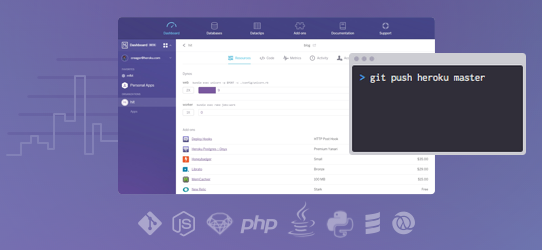

# Workshop - Java Play and Postgres on Heroku

  [Heroku](https://www.heroku.com) is gives developers an easily way deploy, scale and monitor applications without the need for extensive DevOps training or tooling.

This workshop will guide you through all the steps to build, deploy and monitor a relatively simple Java application using the Play framework and Postgres database.  Examples of using Heroku with other languages and frameworks will also be discussed and you are encouraged to try out your own projects on Heroku too.
  
> **Note** This is a practical workshop, however all the code for a working application is provided and is also available from repositories on Github.  Expertise with any of the languages or frameworks used is not required, unless you want to develop any of the applications further.

## Heroku - Platform as a Service

  [Heroku](https://www.heroku.com) is a service that allows developers to deploy applications using the tools they are already familiar with (build & version control and CI tools).  If you can use Git, then you can simply push your code to Heroku and it will be deployed and run for you.
  
> **Hint** If you have not yet learnt Git we can help with that during the workshop, or you can visit [try.github.io](http://try.github.io) or my [Git Workshop](http://jr0cket.co.uk/git-workshop/)

  Heroku is a polyglot platform as it can run many different programming languages and frameworks.  Heroku provides additional support for the most common languages (Ruby, Node.js, Java, Python, PHP, Scala, Clojure) and there is community support for over 50 other programming languages.

  Other Cloud providers may give you Virtual Machines (eg. like with Virtualbox) to run your apps in the Cloud.  Whilst this may seem a more flexible approach, it also requires greater responsibility in managing the Infrastructure.  This is called Infrastructure as a Service (IaaS), as it provides the servers which run your applications, however you are still responsible for maintaining those servers and managing the deploy process.

  Read on for more details on the features that Heroku provides, so you can focus on building your applications.

## Salesforce1 Platform 

  [Heroku](https://www.heroku.com) is part of the [Salesforce1 Platform](https://developer.salesforce.com) and excels at scaling applications to meet the needs of the customer and the business that supports them.  Heroku is ideal for either short or long term projects, especially where demand is harder to predict.

  Heroku is integrated with Salesforce via Heroku Connect or configured as a Trusted App within your Salesforce Org.

> **TODO** links for Heroku connect and guides to connected apps & api use 

---

| Author | Version | Contact
| -- | -- | -- |
|John Stevenson | 0.1 | [@jr0cket](https://twitter.com/jr0cket)

