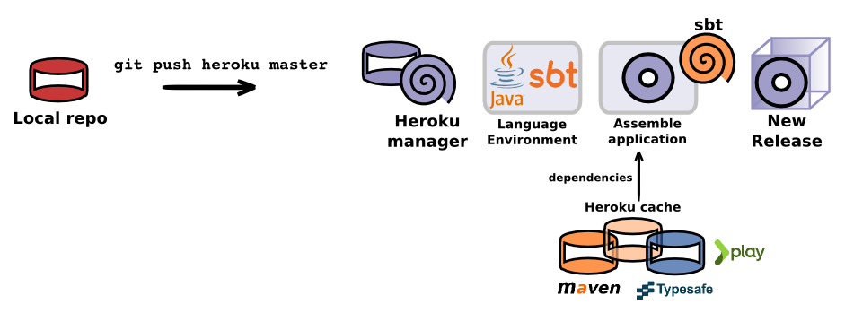

# Deploy the sample App

  Using standard Git command you will push your code securely to Heroku.
  
> **Info** We show you this via the command line so you see the actuall commands and paramters, however you are free to use any Git client.

  In the folder containing the code you downloaded, `java-play-sample-app`, run the following commands:
  
    heroku create 
    
    git push heroku master 

  You will see details of the deployment 

> **fixme** sample deployment output

---

### What happens when I push my code ?
  
  The following steps happen each time you push a new change to Heroku for your app:

  
  * Git compresses the changes in your local git repository, so there is less data to send
  * Heroku repository unpacks the code and adds the new commits to its repository for your app 
  * Heroku detects what language your application is using and installs the relevant runtime and build tools
  * If your application has depenencies, they are pulled in from either the Heroku archive or standard repositories on the Internet.
  * Your application is compiled if neccessary (using what ever build tool your project uses)
  * A single file called a **Slug** is created, this is your complete application ready to be started
  * A dyno (a Linux container compute resource) is started and your Slug is loaded into the dyno.
  * Any processes defined in the `Procfile` for your project or processes defined in the buildpack for your langauge are started.

> **Info** Heroku has a mirror of many of the common dependencies used for each of its supported languates.  This mirror is used by buildpacks to speed up the deployment process.  

> Dependencies are also cached between deploys to save downloading the Internet on each deploy.
