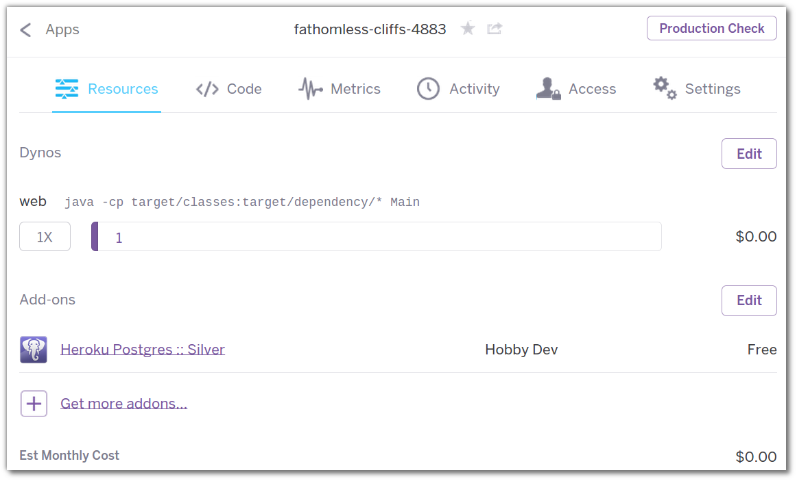
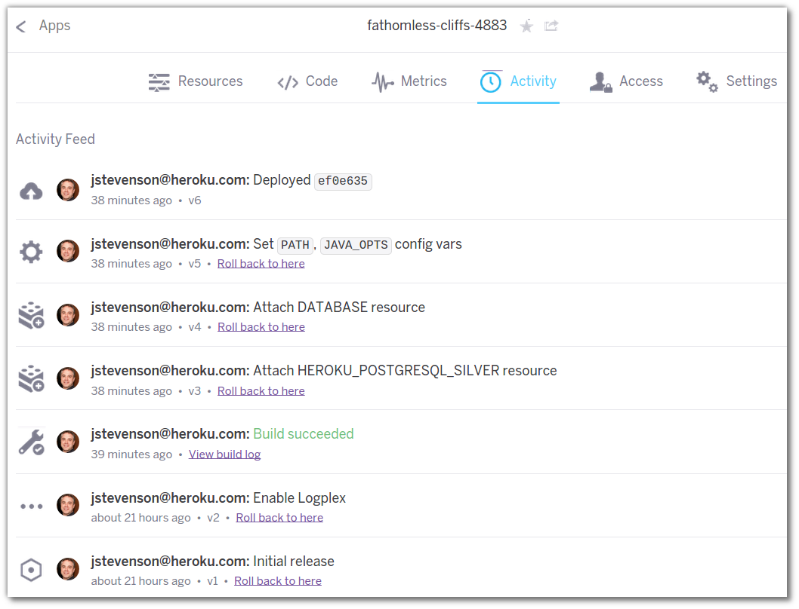

# Dashboard view of the sample Java app

> **Note** Open your Heroku dashboard in a browser by visiting [www.heroku.com](https://www.heroku.com) and logging in.  If you are already logged in when you visit [www.heroku.com](https://www.heroku.com) you are automatically re-directed to the dashboard.

  View the dashboard of the application you just deployed by clicking on its name.  If you have many applications on your Heroku account, you can also use the search bar at the top to filter the list of apps in the list.

  You should see the resources tab of your newly deployed application.  This shows you how many resources you are using for your app (1 dyno) and how much it is costing you a month currently (zero $).
  

 
  Click on the **Activity** tab to see everything that has happend regarding this app on Heroku.  
  
  The first two entries are the initial release and logging service being added, triggered  when you ran the `heroku create` command.  The rest of the activity items were triggered by the `git push` deployment.  They include building the code, attaching a database, setting a database config variable, setting Path & Java config variables and the final release of the app.

