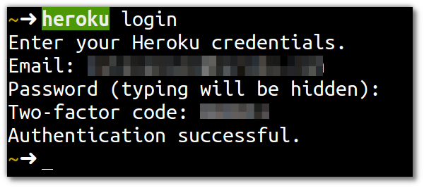
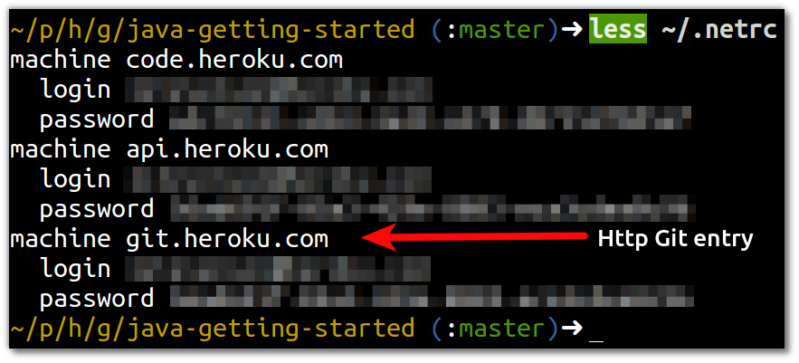

# Authenticating with Heroku

> **Comment** We have a new service to make authenticating your account easier.  Please dont hesitate to let us know if you have any issues.

  To deploy your source code onto Heroku you need to first authenticate yourself (prove you are who you say you are).  You only need to authenticate yourself once per computer you use.

### Authentication via HTTP Git service (new)

  Heroku has released a new service called Http Git which removes the need for a public key and enables those users who would otherwise be stuck behind restrictive firewalls.  

> **Note** To authenticate yourself to heroku, open a command line terminal and enter the following command: 

    heroku login

  Provide your Heroku username and password when prompted.

  
  If this command is successful, your Heroku API key is added to the `~/.netrc` file.  When you run other Heroku Toolbelt commands or push code, this API key is used to authenticate you.

> **Hint** For more information, see the article [Http Git](https://devcenter.heroku.com/articles/http-git).

---

### Authentication by Public Key (optional)
 
  You can also authenticate yourself with Heroku via public key encryption.  To do so you need to add an SSH key to your Heroku account.  This same approach taken by services such as Github, however its much easier to add your key with the Heroku toolbelt.  
  
  If you have an existing SSH key, use the following command

    heroku keys:add

  To use your SSH key with your heroku apps, you need to specify the `--ssh-git` option on the `heroku create` command 
  
  `heroku create --ssh-git my-app`

> **Hint** You can configure Git to always use SSH when pushing to Heroku no mater how the app was create using the command `git config --global url.ssh://git@heroku.com/.insteadOf https://git.heroku.com/`.  More information is in the [Deploying with Git](https://devcenter.heroku.com/articles/git#ssh-git-transport) article.

--- 

### Creating your own key (optional)

  If you do not have an SSH key, you can create one using the `ssh-keygen` command.  When you create the public key, ensure you add the email address of your Heroku account as a comment:

    ssh-keygen -t rsa -C "email@used-for-heroku-account.com"
    
  You can then add a new key to Heroku using the following command:
  
    heroku keys:add 
    
  If you have only one public key, this command will just add it to heroku without prompting.  If you have more than one pubic key then heroku will prompt you as to which key you want to add.

> **Hint**  For more information, see the [Managing SSH Keys](https://devcenter.heroku.com/articles/keys) article on Heroku document center.
  

