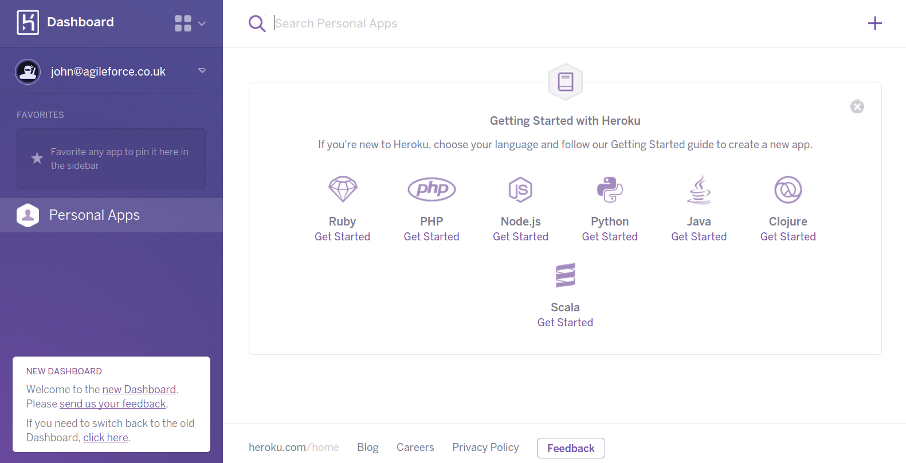

# Heroku Dashboard

You can create and manage your Heroku apps with the web-based [Heroku Dashboard](https://dashboard.heroku.com), supporting many of the tasks you can do with the Heroku Toolbelt.

The Heroku dashboard give you a simple way to create apps and scale the resource each app uses.  It visualises the resources provisioned, deployment activity logs and performance metrics for each of your apps.

> **Info** If you visit [www.heroku.com](https://www.heroku.com) whilst logged into your account you are automatically redirected to the Heroku dashboard.  Should you wish to view the Heroku homepage whist logged in, visit [www.heroku.com/home](https://www.heroku.com/home)

This is what the dashboard looks like when you first start:

  We will explore the dashboard further as we use each of the features of Heroku.

