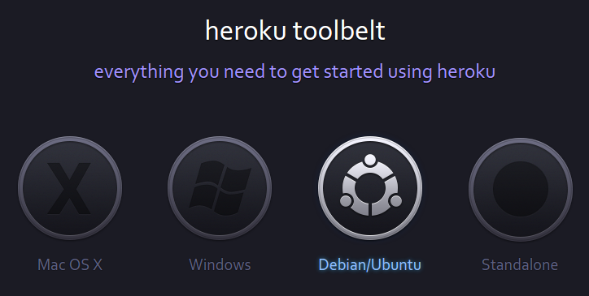
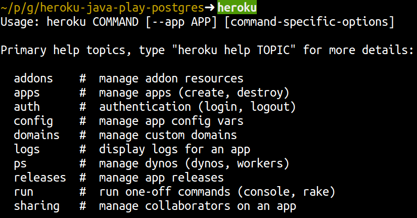

## Installing the Heroku Toolbelt

  The [Heroku toolbelt](https://toolbelt.heroku.com) is a command line application for creating and managing your applications on Heroku.  Its a really useful tool and can also be used to create automated scripts to control Heroku.  The toolbelt also contains a Git client, although you can use your own Git client if you prefer.
  
  Download and install the [Heroku toolbelt website](http://toolbelt.heroku.com).

### Test the Toolbelt installation

  To test if the toolbelt is installed correctly, use the following command: 

    heroku
    
  If you see a list of the Heroku commands available, then the toolbelt is installed successfully.

