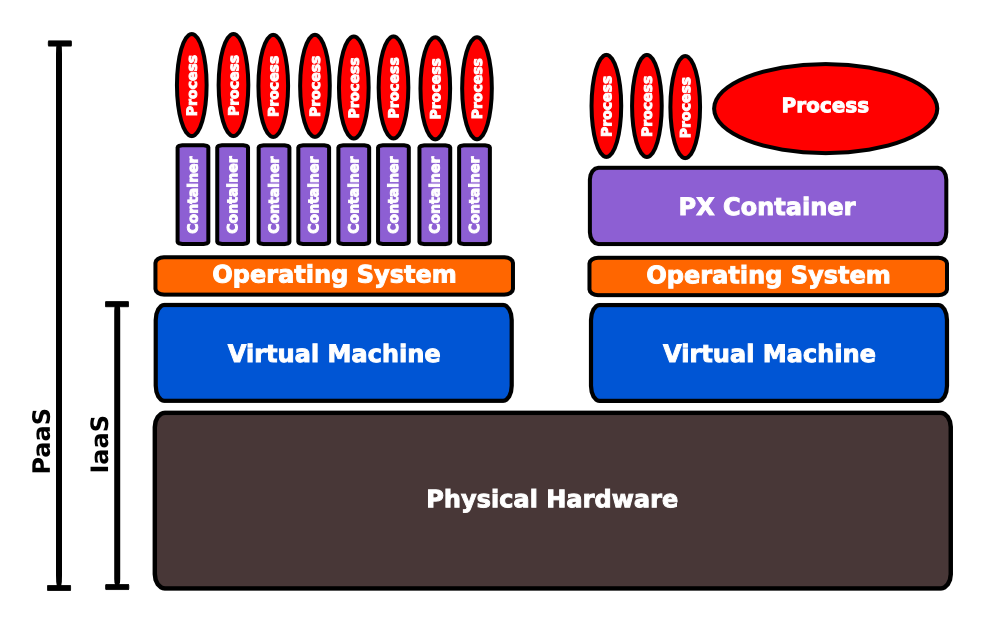

# Abstracting Infrastructure

  You dont need a full blown server to run your app, as that also requires setup and maintenance.  Even using DevOps tools such as Chef, Puppet & Vagrant still take time to set up.  All you really want to do is run your app somewhere other than your laptop or desktop.
  
  Heroku gives you Dynos to run your apps.  
    
## Dynos - a lightweight way to run your apps 
  

> **fixme** review the following section of text
   
  A dyno is the name Heroku use for a container, which is an isolated space for your application to run safely and securely.  A container runs on top of an operating system that may be shared with other containers.
  
  Dyno's are therefore very quick to create and very quick to destroy when no longer needed.  This helps Heroku provide you with a highly scalable Infrastructure without passing on the complexity to you.
  
  When you send your application to Heroku for deployment, a single file is created that represents your application.  This file is called a Slug.  We store each version of the Slug that is created for your app and when you want to scale we copy the relevant slug to any new dynos we create for you.
  
  When you deploy a new version of your app, a new slug file is created.  Then a new set of dynos are created on which this new slug is run, almost instantly upgrading your app to the new version.  Finally, the networking is re-routed to all the dynos running the new version of your app.
  
  To tidy up, all the dynos running the old versions of your app are swiched off.
  
### Dynos in context of the Infrastructure

  To help you put some context into Dynos and the use of containters, here is a highly simplified logical view of the PaaS infrastructure.
  

  On Heroku, your application process runs in a container (Dyno) which in turn runs inside a virtual machine.  The virtual machines run on the physical computer hardware.
  
  Should there be an issue with the physical hardware, the virtual machine & its operating sytem, a new container (dyno) can be instantly created on a working part of the infrastructure and your application process started.
