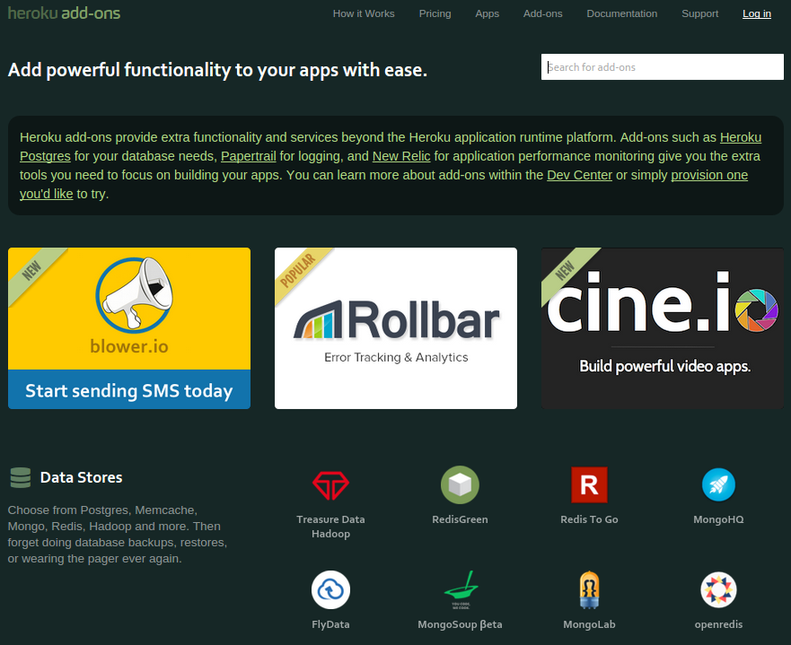

# Addons - datastores, monitoring and other services

  [Heroku Addons](https://addons.heroku.com) is the largest marketplace of any Platform as a Service.  You will find a wide range of products and services to help speed up the development of your applications.

  The marketplace includes [Heroku Postgress](https://postgres.heroku.com), which is an addon we created to give you a Postgress database on demand.  You can provision a Postgres database instantly, with our without an Heroku App.

  Most of the addons have a free service level so you can start using them straight away and quickly evaluate if they are right for your needs.

> **Warning** Your Heroku account needs to be **verified** before you can provision an addon, the exception being Heroku Postgres.  Adding credit card details to your account verifies your account. Your credit card will only be charged if you choose a non-free plan for your addon.

> To verify your account, visit [heroku.com/verify](https://heroku.com/verify)

  The [Heroku Addons](https://addons.heroku.com) marketplace is searchable, so simply type in the kind of datastore or service you are looking for.

