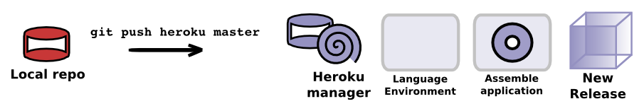
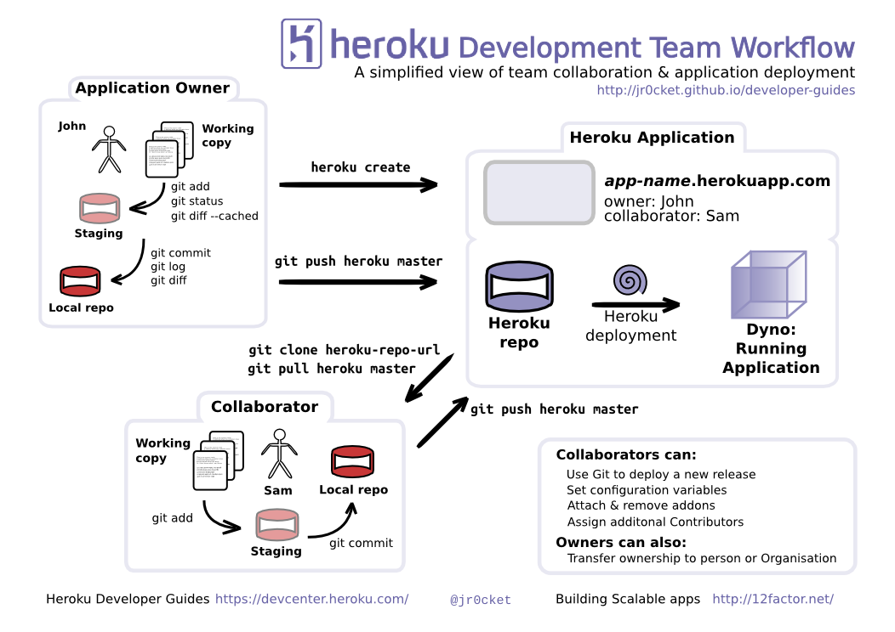
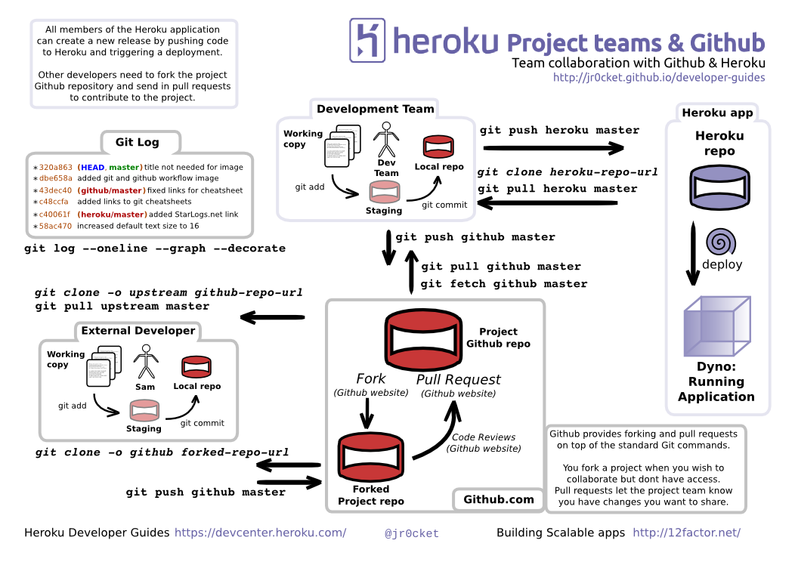

# Developer Driven Development

Heroku uses the tools developer are familiar with, so you dont need to spend weeks learning new tools.

To deploy your application to Heroku, you use Git version control tool to push code to Heroku.  Heroku works out what langauges and frameworks you have used and configures, builds and deploys your application automatically.

> **Comment** If you know the basics of Git, you already know how to deploy onto Heroku.  If you do not know Git, we will show you all you need to know in this workshop.

> You can also develop your skills with Git at [try.github.io](https://try.github.io)

### The developer workflow

  Heroku enables you to iterate on your app at your own pace, whether that be 1 release a month or many releases every hour.  As the deployment process is automated and triggered by a simple push, that deployment can take place by the development team, operations or via continuous integration tools.

  A typical developer workflow is:
  
* Develop your app, committing changes to your local git repository regularly (eg. several times an hour) creating branches where neccessary.

* Push your changes (commits) to a shared repository or continuous integration server, especially when working on a team project (eg. several times a day and/or overnight)  

* Deploy your app with `git push heroku master` when you want to share your running application with others, eg. to let others test it and give feedback or to deploy a feature to production.

---

  Here is a [simple team workflow visualised](http://jr0cket.co.uk/developer-guides/heroku-developer-team-workflow-overview.png):
  

---

  It can be valuable to use a service such as Github or Bitbucket to collaborate on code, as they provide more features in that respect than Heroku.  Here is a [simple team workflow with Github](http://jr0cket.co.uk/developer-guides/heroku-developer-team-workflow-with-github.png):

