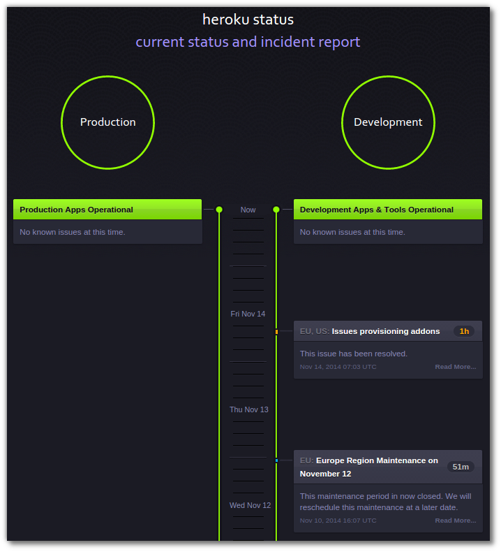
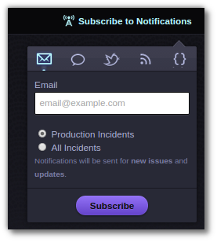
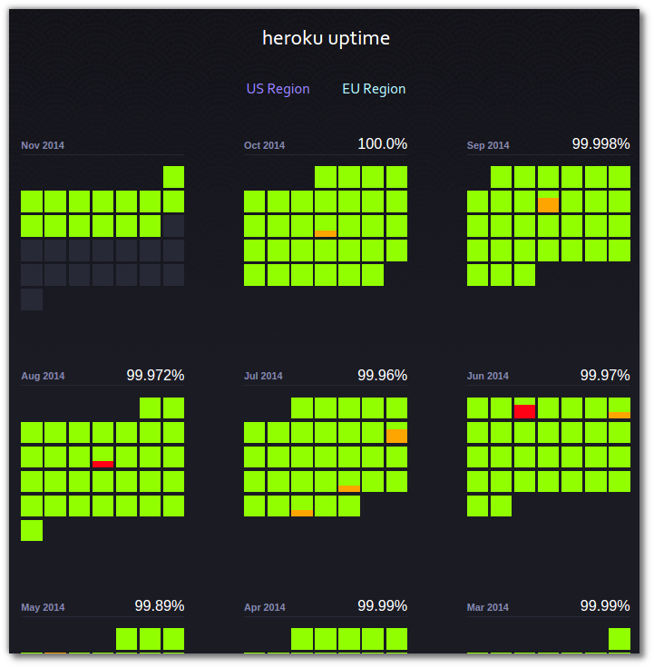

# Heroku Status Website

  The [Heroku Status](https://status.heroku.com) website provides a simple way to see if any issues are occuring on the platform.  Details of any incidents are published here along with any planned maintenance windows.

## Production verses Development 

  Production refers to applications with 2 or more dynos or applications running on PX dynos (and any related infrastructure).

Development refers to everything else (e.g. Deployment processes, Git servers, API calls, toolbelt command, one off processes, etc.).

## Keeping upto date with Heroku Status

You can sign up for alerts on the status website via Email, SMS or RSS.  You can subscribe to just production notifications or all notifications.

## Heroku Uptime 

  You can also see the historic uptime of Heroku, for the US and EU regions
  

