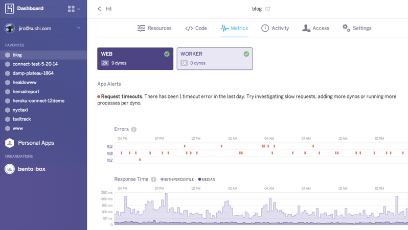
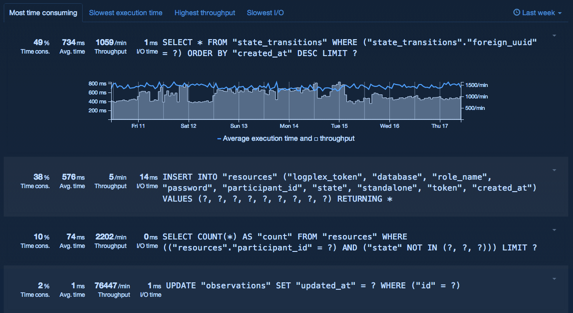
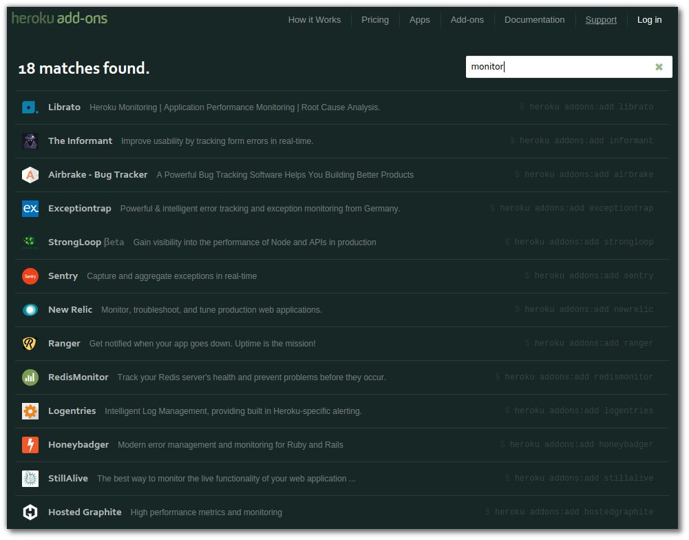

# Monitoring App Performance

If you need your apps to scale then you need to understand as many aspects of your applications performance as you can.

  Its essential that any process listening to web requests responds quickly, anything more than 500ms per response is a cause for concern.  To help ensure fast response times, only the work required to generate the response should be carried out in the web processes. Everything else should be pushed into a background process.
  
  To help you understand how well your application is performing, Heroku has added metrics to the dashboard for any app running 2 or more dynos.

Heroku also provides metrics around your database queries when using Heroku Postgres database.

---

### Addons for Monitoring your apps

  There are a large number of [monitoring services in the Heroku addons](https://addons.heroku.com/?q=monitor), some are tailored to specific languages or monitoring aspects.  Each service is well described in its own page on Heroku addons.

