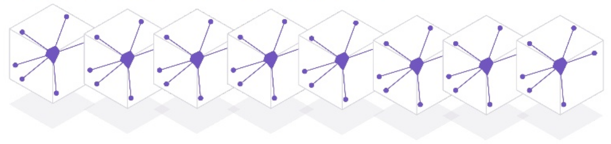

# Scalable Apps

  Heroku provides you with a highly scalable platform on which to run all your applications.  You can scale almost instantly by selecting the resources (dyno's) you need and Heroku automatically provisions them for you.
  
  Simply throwing more and more resources to handle traffic with your app just makes any Paas or IaaS service feel expensive.  It is therefore important to understand how your app will scale to get the best value from the Heroku platform.
  

### Scalable platform != Scalable Apps

  Application design is still your responsibility.  However Heroku share with your their experiences in running their own scalable apps and those of its customers.  

> **fixme** review the 12 factor website and choose the most relevant factors to discuss here
  
  Here are some of the most important factors to consider:

  * Understand your applications performance 
  * Break your app into components & processes 
  * Create different types of processes for different workloads 

> **Hint** See the [12 Factor website](http://12factor.net/) for more details on this interesting and challenging topic.

### Constraints

* response time limits on processes (web, worker, scheduler plugin)

