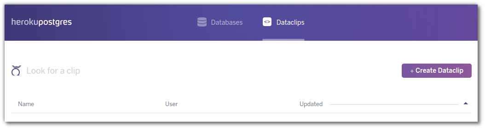
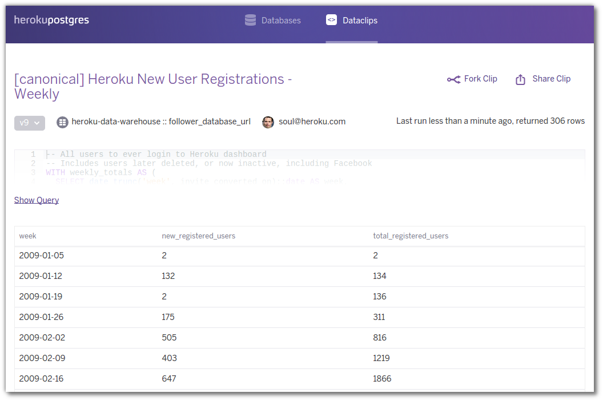
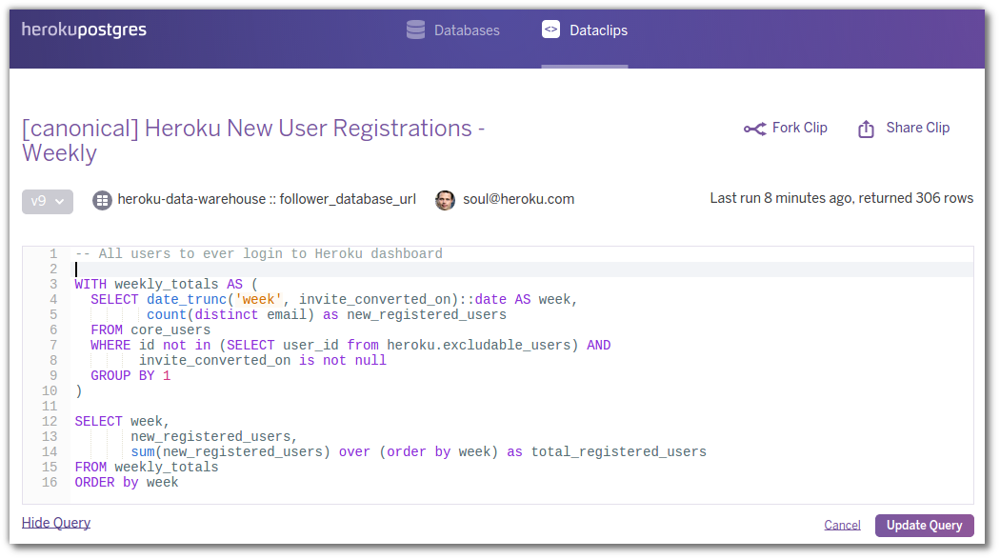
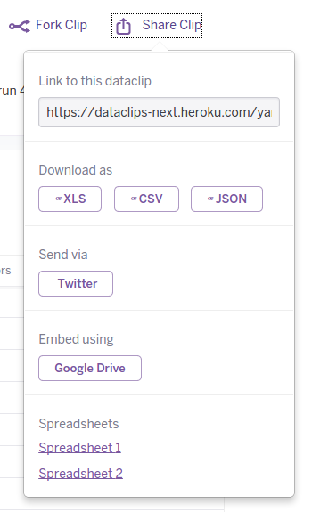

# Heroku Postgres Dataclips

Share and collaborate on database queries 

When you first use Dataclips

# Example dataclip 

Lets look at the query that drives the data clip 

Share a dataclip 

Example list of dataclips 

<!-- 
Example data clip from Heroku 
https://dataclips-next.heroku.com/yamijuevuboyfdxziyjkpqwxqtdf
-->
