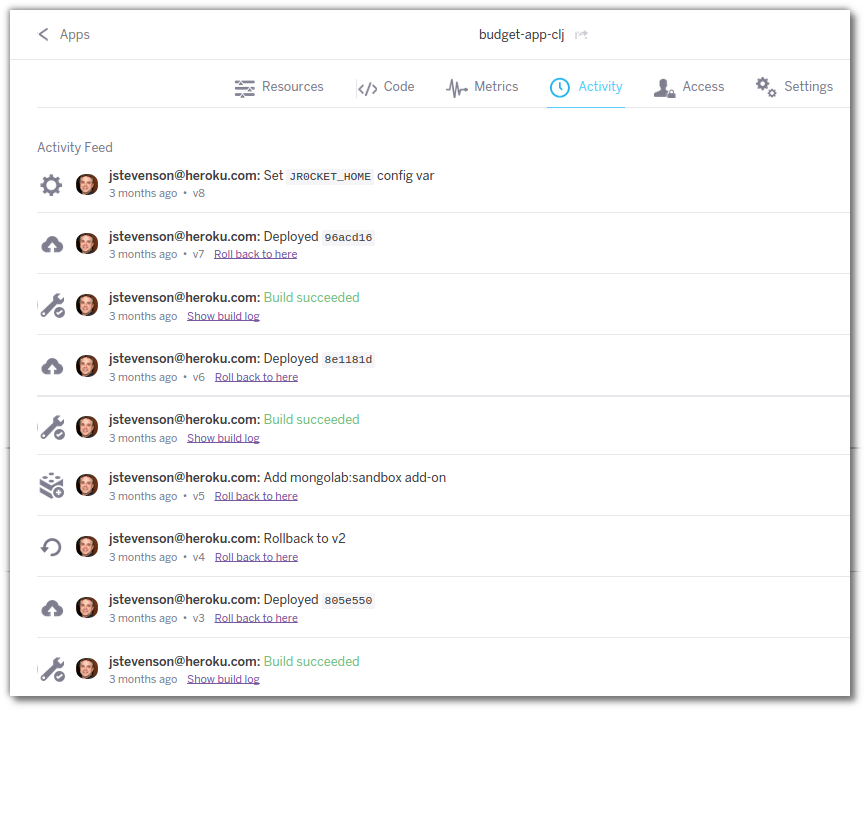
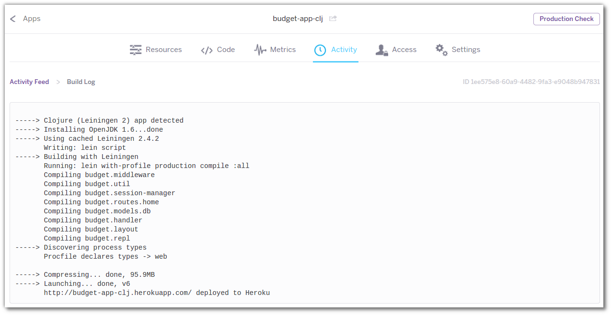

# Heroku Dashboard Activity Log 

  Heroku Dashboard has a section called Activity that shows a feed of all the information around your app, including
  
  * the build process 
  * adding config vars
  * provioning addons 
  * release and rollbacks

  You can also drill down into the build log to see the steps Heroku went through to deploy your app
  

