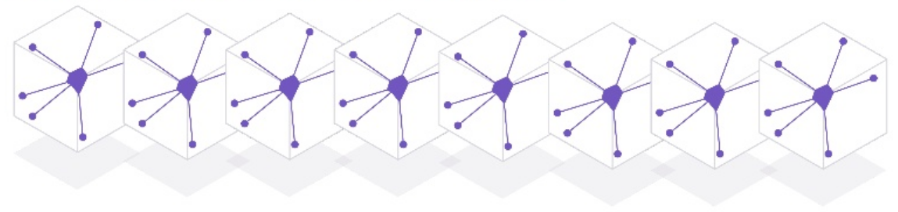

# Scaling Apps 

  Scaling your apps is easily achived by adding more dyno's to your Heroku app.  You will see how to use the dashboard and toolbelt to specify how many resources you want to run for each of your application processes.
  
  You can scale up (vertically) by adding more dyno's to a specific application process, eg. the process listening to web traffic for your app.
  
  You can scale out (horizontally) by adding different process type to your application.  Each process type provides a different service or responsible within your overal app, eg. background task, queue processing, etc.  There will be more about process types in the [Process Model](../process-model/index.html) section. 
  
  If you need to refresh your memory as to what a Dyno is and how it fits in, review the [Abstracting Infrastructure](../heroku-overview/abstracting-infrastructure.html) section of this workshop.

> **Warning** Scaling your app to more than one 1x dyno will exceed your free monthly credits.  It is advisable to scale your dyno usage to zero whist your app is not in use to help ensure you do not incure any charge.

### Challenge of Scaling
  
  The challenge of scaling is knowing how much your appliction needs to effectively scale by.  This decision is effected by:
  
  * The usage patterns of your application 
  * The performance of all the parts of your application
  
  It is important to understand the performance of your app before scaling it and also continue to monitor performance and usage as you scale.  
  
> **Info** Auto-scaling services are availble from the Heroku marketplace.  To use that kind of service effectively you still need to understand performance and useage patterns for your app.

---

 
 
