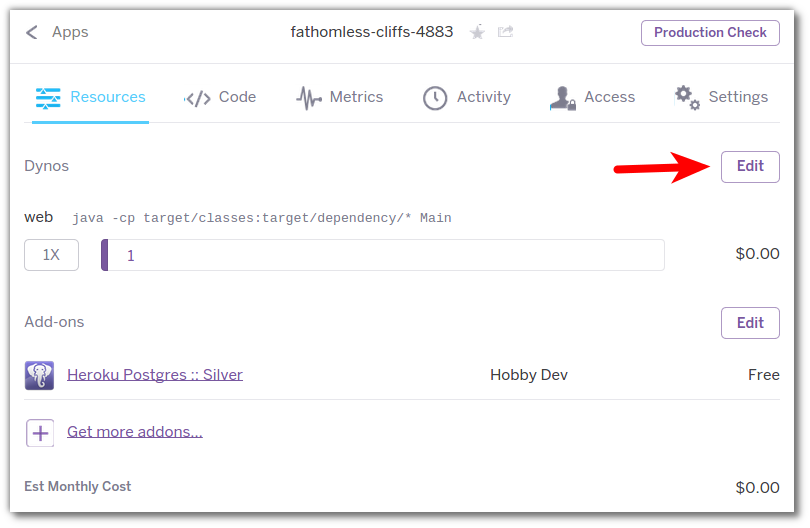
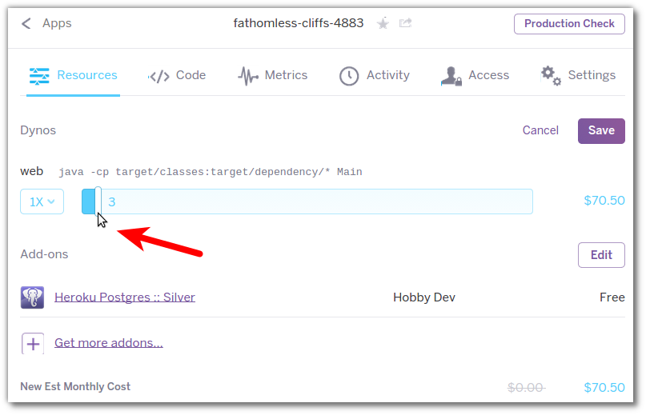
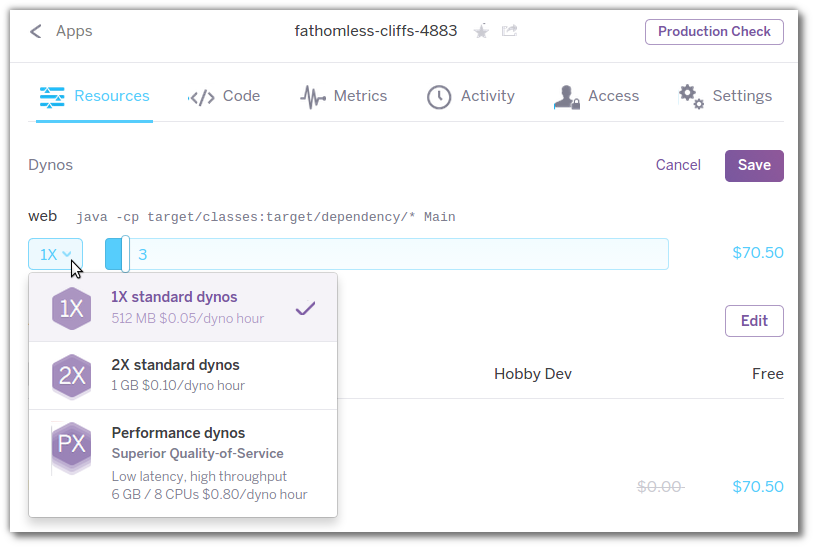

# Scaling with the Heroku Dashboard 

  In the resource tab of the Heroku dashboard you can see at a glance how many resource you are using to run your application.
  
  You can see the number and type of Dyno's running, as well as any addons provisioned.
  
  
> **Note** See how easy it is to scale your app resource using the dashboard.

  On the resource tab for you Heroku app, select edit to change the resource provisioning

  Now you can move the slider to select how many dynos you wish to run your application on:

  You can also change dyno types should you need more resources per dyno.

> **Comment** PX size dynos are ideal for languages and frameworks that can run as a multi-threaded process.  The more processes running within your application project, the greater memory and processor capacity you need. 

## Cancel your changes 

  Click cancel so you do not use up any extra monthly credits.

---

